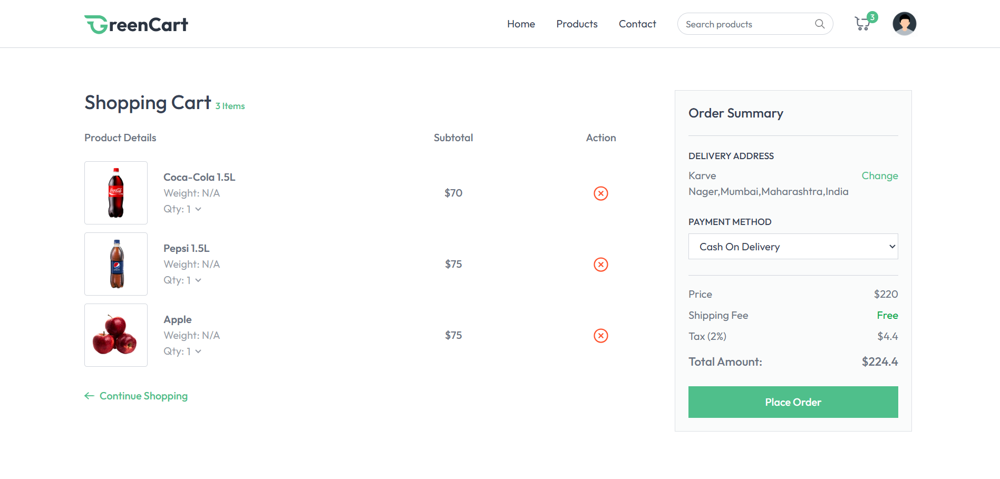

# 🛍️ E-Commerce Website  

---

## ✨ **Hello World! I'm Yash Ghatge**  
> _"I blend logic with creativity to build digital experiences that matter."_  

Passionate developer with expertise in **modern web applications** using the **JavaScript** and **Python ecosystem**.  
Currently exploring **AI integration** to build **smart and efficient apps**.  

🔗 **[Portfolio](https://my-portfolio-git-main-yash-ghatges-projects.vercel.app/)** | [LinkedIn](https://www.linkedin.com/in/yash-ghatge-4a44252a9/) | [Gmail](mailto:yashghatge012@gmail.com)

---

## 🚀 **About the Project**
This is a **full-stack E-commerce website** that provides a **secure and seamless shopping experience**.  
It includes **product browsing, cart management, secure authentication, and order handling**.  

### **Key Features**
✅ User authentication & authorization (JWT & bcrypt)  
✅ Product listing, categories & filters  
✅ Add to cart & checkout flow  
✅ Integrated payment gateway *(demo mode)*  
✅ Admin dashboard for managing products & orders  
✅ Fully responsive & SEO-optimized  

---

## 🛠 **Tech Stack**

### 🌐 **Frontend**

### ⚙ **Backend**

### 🛠 **Tools**

---

## 🖼 **Project Screenshots**

| **Homepage** | **Product Page** |
|-------------|------------------|
|  |  |

| **Cart Page** | **Admin Page** |
|--------------|-------------------|
|  |  |

---

## 📚 **Learning**
- AI Integration & ChatGPT API  
- WebSockets for real-time apps  
- SEO best practices for web visibility  
- Jest for unit & integration testing  
- Optimizing performance in large-scale apps  

---

## 🤝 **Connect With Me**
🌐 [**Portfolio**](https://my-portfolio-git-main-yash-ghatges-projects.vercel.app/)  
💼 [**LinkedIn**](https://www.linkedin.com/in/yash-ghatge-4a44252a9/)  
📧 [**Gmail**](mailto:yashghatge012@gmail.com)

---
